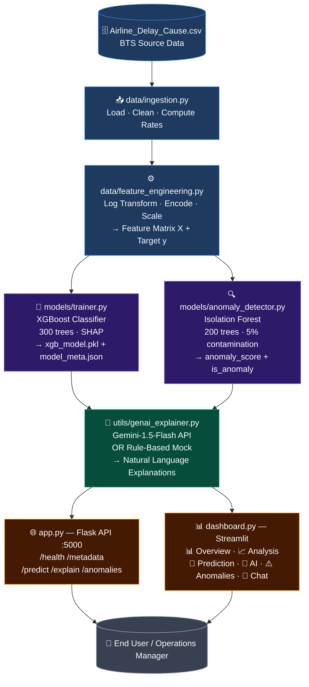

# GenAI-Powered Flight Delay Analytics System — Architecture Flowchart

---

## Layer-by-Layer Breakdown

### 🟦 Layer 1 — Data Ingestion & Cleaning
| File | Responsibility |
|------|---------------|
| `Airline_Delay_Cause.csv` | BTS source data: monthly carrier × airport delay stats |
| `data/ingestion.py` | Loads CSV, drops nulls, computes `delay_rate`, `cancel_rate`, and 5 delay-cause percentage columns |

### 🟦 Layer 2 — Feature Engineering
| File | Responsibility |
|------|---------------|
| `data/feature_engineering.py` | `log1p` flight volume, cyclic `month_sin/cos`, label-encodes carrier & airport, quintile distance bucket, StandardScaler → returns feature matrix **X** + binary target **y** (`high_delay`) |

---

### 🟣 Layer 3 — ML Models (trained in parallel on same cleaned data)

| Model | File | Output |
|-------|------|--------|
| **XGBoost Classifier** | `models/trainer.py` | Predicts `HIGH DELAY / ON-TIME` + calibrated probability + SHAP values → saved as `xgb_model.pkl` + `model_meta.json` |
| **Isolation Forest** | `models/anomaly_detector.py` | Detects statistically unusual carrier-airport-month records → `anomaly_score` + `is_anomaly` flag + human-readable label |

---

### 🟢 Layer 4 — GenAI Explanation Layer
| File | Responsibility |
|------|---------------|
| `utils/genai_explainer.py` | **Priority 1**: `gemini-1.5-flash` via `GEMINI_API_KEY` for rich contextual explanations. **Fallback**: Rule-based mock explainer using SHAP values + feature values (fully offline). Also handles chatbot Q&A (`answer_flight_query`). |

---

### 🟠 Layer 5 — Serving Layer

| Component | File | Details |
|-----------|------|---------|
| **Flask REST API** | `app.py` | Port 5000. Endpoints: `GET /health`, `GET /metadata`, `POST /predict`, `POST /explain`, `GET /anomalies` |
| **Streamlit Dashboard** | `dashboard.py` | 6 tabs: 📊 Overview · 📈 Delay Analysis · 🤖 Prediction · 🧠 AI Explanation · ⚠️ Anomalies · 💬 AI Chatbot |

---

## End-to-End Data Flow

> [!NOTE]
> The Streamlit dashboard (`dashboard.py`) can run in **standalone mode** — it loads `xgb_model.pkl` directly and does not require the Flask API to be running. The Flask API is only needed if you want external REST access to the prediction endpoints.

> [!TIP]
> Set `GEMINI_API_KEY` in your `.env` file to unlock live AI explanations via Gemini. Without it, the offline rule-based explainer activates automatically with no code changes needed.
